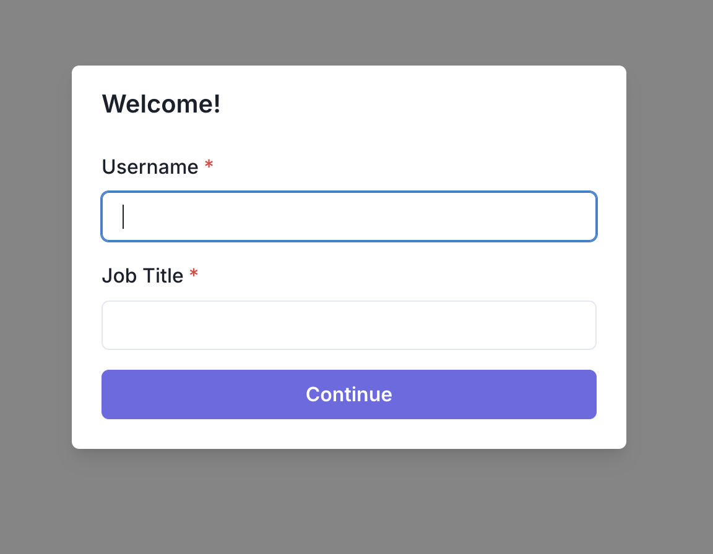
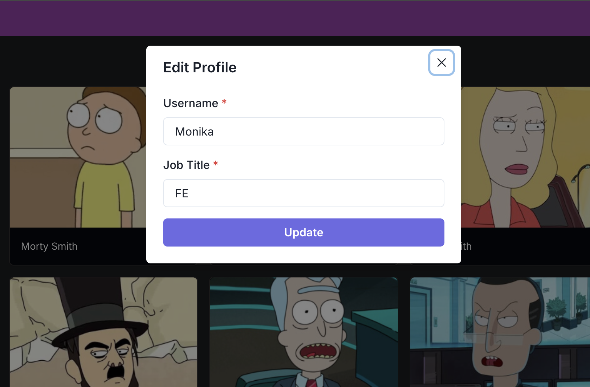
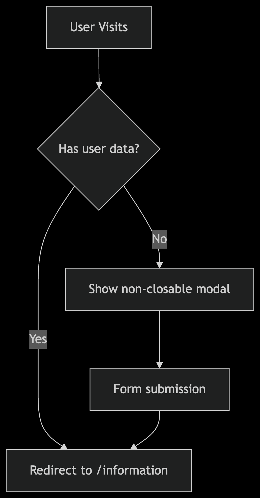

# Leonardo.ai test 🌌

Thank you for reviewing my implementation of this technical task!

I found the requirements clear and well-structured, which allowed me to focus on building a production-ready solution. The project was particularly enjoyable as it touched on key web development concepts:

Authentication flow with persistent user data

GraphQL integration with Apollo Client

Responsive UI using Chakra UI

Clean state management with Context API

## I'd love to hear your feedback on:

My architectural decisions, Areas for improvement etc.

This is a [Next.js](https://nextjs.org) project bootstrapped with [`create-next-app`](https://nextjs.org/docs/app/api-reference/cli/create-next-app).

## Getting Started

First, run the development server:

```bash
npm run dev
# or
yarn dev
# or
pnpm dev
# or
bun dev
```

Open [http://localhost:3000](http://localhost:3000) with your browser to see the result.

[](https://leonardo-ai-tech-test.vercel.app/) https://leonardo-ai-tech-test.vercel.app/

A production-ready Next.js application demonstrating advanced patterns for authentication, data fetching, and state management.

 
 
 
 
 
 

## ✨ Key Features

### 🔒 Authentication Flow
- Non-closable onboarding modal for mandatory user registration
- LocalStorage persistence with edit functionality
- Protected routes with automatic redirects

🛠 Tech Stack
Core	Next.js 14 (App Router), TypeScript
UI	Chakra UI, Framer Motion
State	React Context, LocalStorage
API	Apollo Client, GraphQL
Infrastructure	Vercel (Serverless)
